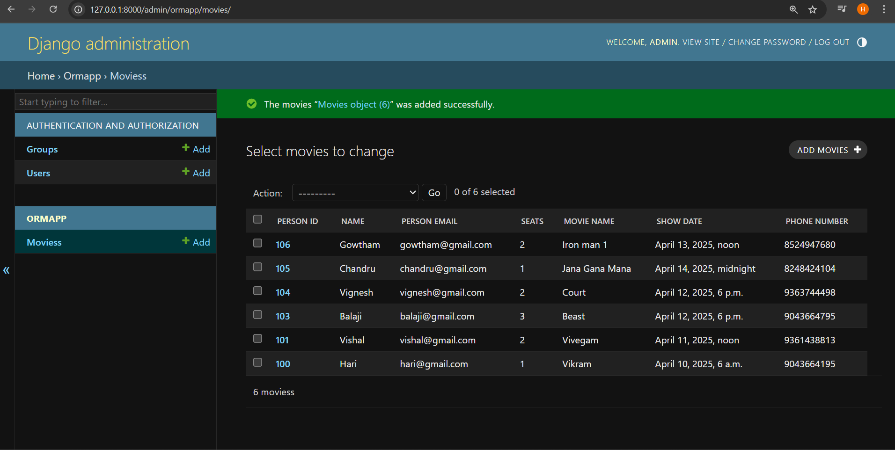

# Ex02 Django ORM Web Application
## Date: 16.04.2025

## AIM
To develop a Django application to store and retrieve data from Movies Database using Object Relational Mapping(ORM).


## DESIGN STEPS

### STEP 1:
Clone the problem from GitHub

### STEP 2:
Create a new app in Django project

### STEP 3:
Enter the code for admin.py and models.py

### STEP 4:
Execute Django admin and create details for 10 books

## PROGRAM
```
admin.py

from django.contrib import admin
from .models import Movies,MoviesAdmin
admin.site.register(Movies, MoviesAdmin)

models.py

from django.db import models
from django.contrib import admin
class Movies(models.Model):
    person_id= models.CharField(max_length=20, help_text="User ID")
    name= models.CharField(max_length=100)
    person_email= models.EmailField()
    seats= models.IntegerField()
    Movie_Name=models.CharField(max_length=20)
    Show_Date=models.DateTimeField()
    Phone_Number=models.CharField(max_length=10, help_text="Phone number")
class MoviesAdmin(admin.ModelAdmin):
    list_display = ('person_id', 'name', 'person_email', 'seats', 'Movie_Name','Show_Date','Phone_Number')


```


## OUTPUT




## RESULT
Thus the program for creating a database using ORM hass been executed successfully
